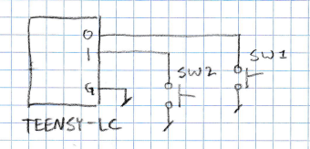

# PgUpDnPedal
Page turning pedal

Francis Deck, Dec. 7, 2020

This is a simple design for a page turning pedal. Its most likely use is reading sheet music on a tablet device. I wanted to try reading music from a tablet, just to see if I can stand the tiny screen. I'm a jazz double bassist, so my hands are occupied when I'm playing, and while it's easy to flip pages on paper charts, it can be frustrating on a tablet. You can buy a Bluetooth pedal for this purpose, but I decided to quickly whip one up of my own.

It's based on Teensy LC, a low cost microcontroller development board. For hardware, all it needs are two pushbutton switches and a housing. The Teensy LC is intended to be programmed in the Arduino development environment, and it comes with libraries for emulating a USB keyboard. So the pedal is just a two button keyboard!

I really like the Teensy family of boards. You can treat them "like an Arduino" using the standard libraries, and a lot of Arduino code will run on them directly. But Arduino is just a thin wrapper around GCC, and the Teensy libraries expose the entire register space of the microcontrollers, so it's easy to reach bare metal and make use of the full functionality of the chips at top performance.

Circuit design

Here it is, in all its glory: A Teensy LC and two pushbutton switches.

